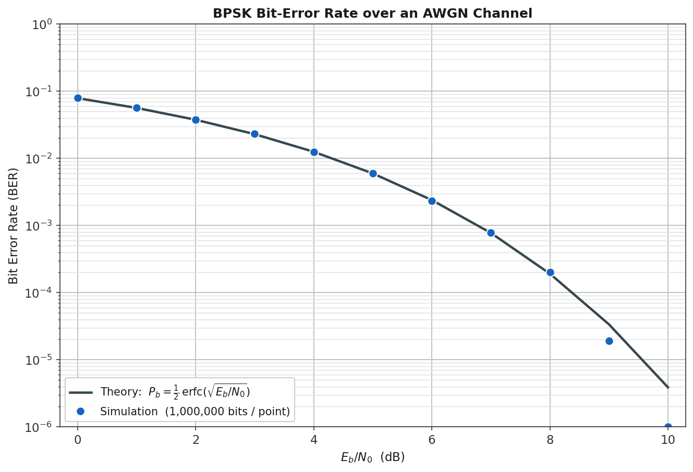
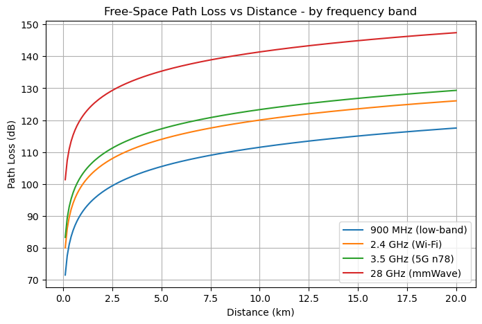
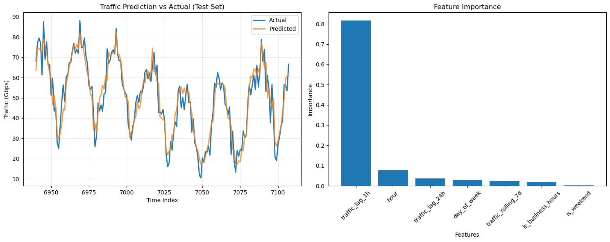
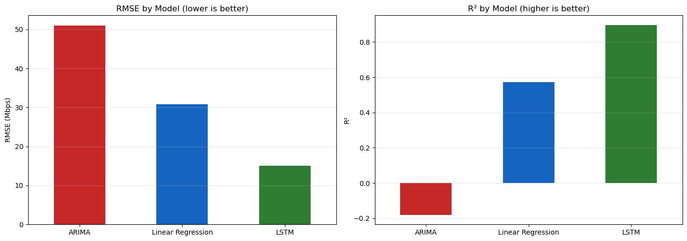
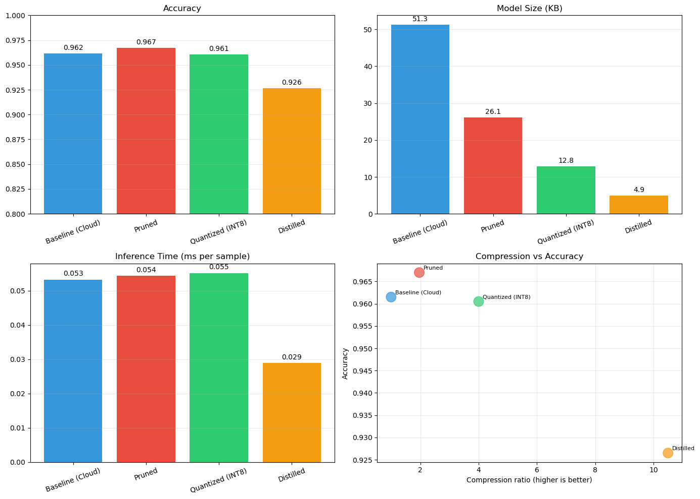

# Project Documentation

Detailed documentation of all practical work in this course. Each project is documented with its **problem statement**, **methods and tools**, a representative **code snippet** (full code linked in the repository), and **results with interpretation**. All notebooks run top-to-bottom with fixed random seeds (42) and embedded outputs.

**Repository:** <https://github.com/martindemel/ITAI-4370-5G>

| # | Project | Folder |
|---|---------|--------|
| 1 | BPSK Communication System & Signal Flow | [`Labs/L01_Communication_System_Signal_Flow/`](../Labs/L01_Communication_System_Signal_Flow/) |
| 2 | RF Propagation — Free-Space Path Loss | [`Labs/L02_RF_Propagation_FSPL/`](../Labs/L02_RF_Propagation_FSPL/) |
| 3 | Network Traffic Prediction (Random Forest) | [`Labs/L03_Network_Traffic_Prediction/`](../Labs/L03_Network_Traffic_Prediction/) |
| 4 | Time-Series Forecasting — ARIMA vs Regression vs LSTM | [`Labs/L04_Time_Series_Prediction/`](../Labs/L04_Time_Series_Prediction/) |
| 5 | Edge Model Optimization (Pruning · Quantization · Distillation) | [`Labs/L05_Edge_Model_Optimization/`](../Labs/L05_Edge_Model_Optimization/) |
| 6 | Midterm — Network Simulation & Predictive Optimization | [`Midterm/Network_Simulation_and_Prediction/`](../Midterm/Network_Simulation_and_Prediction/) |

---

## Project 1 — BPSK Communication System & Signal Flow

**Problem statement.** Model a complete digital communication link — `Source → Modulator → Channel → Demodulator → Receiver` — both conceptually (block diagram) and as a working simulation, then quantify how channel noise degrades communication.

**Methods and tools.** Python, NumPy, SciPy, Matplotlib; Draw.io for the editable block diagram. BPSK modulation on a cosine carrier; AWGN channel; coherent demodulation (multiply by carrier, integrate-and-dump); threshold detection. Extended with a 1,000,000-bit-per-point Monte-Carlo BER sweep across E<sub>b</sub>/N<sub>0</sub> = 0–10 dB, compared against the closed-form theory.

**Code** (the demodulation core — [full notebook](../Labs/L01_Communication_System_Signal_Flow/Lab1_Communication_System.ipynb), [analysis suite](../Labs/L01_Communication_System_Signal_Flow/analysis/bpsk_comm_analysis.py)):

```python
# 4. Demodulator: multiply by carrier, average over each bit
demod    = rx * carrier
decision = demod.reshape(N, sps).mean(axis=1)
# 5. Receiver: decide each bit
bits_out = (decision > 0).astype(int)
```

**Results and interpretation.** All transmitted bits recovered without error at σ = 0.5; the simulated BER tracks theory across the full sweep (at 7 dB: 7.78×10⁻⁴ simulated vs 7.73×10⁻⁴ predicted). Interpretation: the channel is the only block that damages the signal, coherent demodulation with integrate-and-dump is the optimal (matched-filter) receiver for BPSK in AWGN, and in the steep region of the BER "waterfall" each extra dB of SNR roughly halves the error rate — the physical basis for how all digital links, including 5G NR, are engineered.



---

## Project 2 — RF Propagation: Free-Space Path Loss

**Problem statement.** Quantify how a radio signal weakens with distance and frequency, and explain what this implies for real network deployment across the bands 5G actually uses.

**Methods and tools.** Python, NumPy, Matplotlib. The ITU free-space path loss model *FSPL(dB) = 20·log₁₀(d) + 20·log₁₀(f) + 32.44*, evaluated over 0.1–20 km for 900 MHz, 2.4 GHz, 3.5 GHz (5G n78), and 28 GHz (mmWave).

**Code** ([full notebook](../Labs/L02_RF_Propagation_FSPL/Lab2_RF_Propagation.ipynb)):

```python
def fspl_db(d_km, f_mhz):
    return 20*np.log10(d_km) + 20*np.log10(f_mhz) + 32.44
```

**Results and interpretation.** At 1 km: 91.5 dB (900 MHz), 100.0 dB (2.4 GHz), 103.3 dB (3.5 GHz), 121.4 dB (28 GHz). The ~30 dB penalty of mmWave versus low-band — one-thousandth of the received power — is the physical reason 5G high-band is deployed as dense small cells while low-band provides wide-area coverage. Network topology is propagation physics made visible.



---

## Project 3 — Network Traffic Prediction (Supervised Learning)

**Problem statement.** Predict the next hour's network traffic from historical data, the forecasting capability an intelligent RAN needs to allocate resources before congestion forms.

**Methods and tools.** Python, pandas, scikit-learn (RandomForestRegressor, 100 trees), Matplotlib/seaborn. Synthetic year of hourly traffic with daily/weekly/annual/business-hours patterns; engineered features (1 h and 24 h lags, 7-day rolling average, calendar features); strictly time-ordered 80/20 split.

**Code** ([full notebook](../Labs/L03_Network_Traffic_Prediction/Lab3_Traffic_Prediction.ipynb)):

```python
# Split in time order (no shuffle): test set = later, unseen hours
X_train, X_test, y_train, y_test = train_test_split(
    X, y, test_size=0.2, random_state=42, shuffle=False)
rf_model = RandomForestRegressor(
    n_estimators=100, max_depth=10, random_state=42, n_jobs=-1)
```

**Results and interpretation.** Test R² = 0.893 (train 0.946), test MSE 34.65. Feature importance: previous hour 0.816, hour-of-day 0.078, 24-hour lag 0.036. Interpretation: traffic is habitual — recent history plus time of day carries nearly all the signal — and honest forecasting evaluation requires the test set to lie strictly in the future of the training set.



---

## Project 4 — Time-Series Forecasting: ARIMA vs Regression vs LSTM

**Problem statement.** Compare three forecasting families on the same traffic series to determine which approach best predicts strongly cyclical network demand — and evaluate them honestly.

**Methods and tools.** Python, statsmodels (ARIMA, seasonal decomposition, ADF stationarity test), scikit-learn (LinearRegression + StandardScaler over 16 engineered features), PyTorch (LSTM, hidden size 32, 24-hour lookback). Simulated year of hourly traffic with daily/weekly cycles, yearly trend, seasonality, and congestion spikes; chronological 80/20 split.

**Code** (the leakage fix — [full notebook](../Labs/L04_Time_Series_Prediction/Lab4_Time_Series_Prediction.ipynb)):

```python
# moving averages on PAST hours only (shift(1) -> no target leakage)
f['ma_3']   = f['traffic_mbps'].shift(1).rolling(3).mean()
f['ma_24']  = f['traffic_mbps'].shift(1).rolling(24).mean()
f['ma_168'] = f['traffic_mbps'].shift(1).rolling(168).mean()
```

**Results and interpretation.**

| Model | RMSE | R² |
|-------|-----:|---:|
| ARIMA(2,1,2) | 51.03 | −0.181 |
| Linear Regression | 30.84 | 0.572 |
| **LSTM** | **15.07** | **0.897** |

A non-seasonal ARIMA flattens to the mean over a long horizon; engineered lags recover the weekly cycle for a linear model; the LSTM learns the daily shape directly from sequences and wins. The project's most important finding was methodological: the brief's original moving-average features included the value being predicted, producing a meaningless R² of 1.0 — a textbook case of target leakage, fixed by shifting all windows to past-only data. Documented caveat: ARIMA forecasts the whole horizon at once while the other two predict one hour ahead, so the comparison reflects both model and task.



---

## Project 5 — Edge Model Optimization

**Problem statement.** A cloud-grade model cannot run on a constrained edge device, yet Multi-access Edge Computing requires inference at the network edge. Compress a classifier and quantify the accuracy/size/speed trade-off of each technique.

**Methods and tools.** Python, PyTorch (`torch.nn.utils.prune`, custom INT8 quantization, knowledge distillation with temperature-softened KL loss), scikit-learn (synthetic IoT sensor dataset: 10,000 samples, 20 features, 3 classes). The course brief targeted TensorFlow/TFLite, which crashed in this environment; the entire lab was reimplemented in PyTorch with each technique made functional.

**Code** (the distillation loss — [full notebook](../Labs/L05_Edge_Model_Optimization/Lab5_Edge_Model_Optimization.ipynb)):

```python
hard = ce(s_logits, yb)                                  # match the true labels
soft = kl(torch.log_softmax(s_logits / TEMP, 1),
          torch.softmax(tl / TEMP, 1)) * (TEMP ** 2)     # match the teacher
(ALPHA * hard + (1 - ALPHA) * soft).backward()
```

**Results and interpretation.**

| Model | Accuracy | Size (KB) | Inference (ms) | Compression |
|-------|---------:|----------:|---------------:|------------:|
| Baseline (cloud) | 96.2% | 51.26 | 0.053 | 1.0× |
| Pruned (50%) | 96.7% | 26.07 | 0.054 | 2.0× |
| Quantized (INT8) | 96.1% | 12.82 | 0.055 | 4.0× |
| Distilled | 92.7% | 4.89 | **0.029** | **10.5×** |

Pruning and quantization preserve accuracy at 2–4× smaller storage; distillation buys 10× compression and the only real speedup — because a genuinely smaller architecture reduces compute, while zeroed weights and simulated INT8 reduce only storage on standard hardware. Deployment mapping: distilled/INT8 for microcontrollers, pruned/quantized for gateways, full model for edge servers.



---

## Project 6 — Midterm: Network Simulation & Predictive Optimization

**Problem statement.** Model a network's dynamic behavior three ways: (1) measure packet latency through a router chain, (2) show congestion and recovery emerging from local router rules, and (3) predict traffic so routing can be optimized proactively.

**Methods and tools.** SimPy (discrete-event simulation), Mesa + NetworkX (agent-based model on a Watts–Strogatz small-world graph), scikit-learn (lag-feature linear regression), NumPy/pandas/Matplotlib.

**Code** (the SimPy packet process — [full solution](../Midterm/Network_Simulation_and_Prediction/Mid%20Term.txt)):

```python
def packet(env, name, routers):
    start_time = env.now
    for router in routers:
        with router.request() as req:
            yield req
            yield env.timeout(PROC_DELAY)
    print(f"{name} completed at {env.now}, total delay = {env.now - start_time}")
```

**Results and interpretation.** The SimPy trace shows per-packet, per-hop delays accumulating through the three-router chain — latency as an emergent property of shared, capacity-1 resources. The Mesa model shows routers crossing the 80% load threshold announcing rerouting, then recovering, with no central controller — the core mechanism of Self-Organizing Networks. The regression closes the loop from observing traffic to anticipating it, the seed of predictive resource allocation developed further in Labs 3 and 4.
