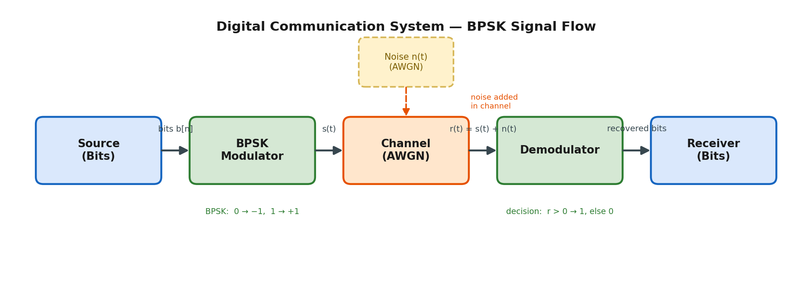
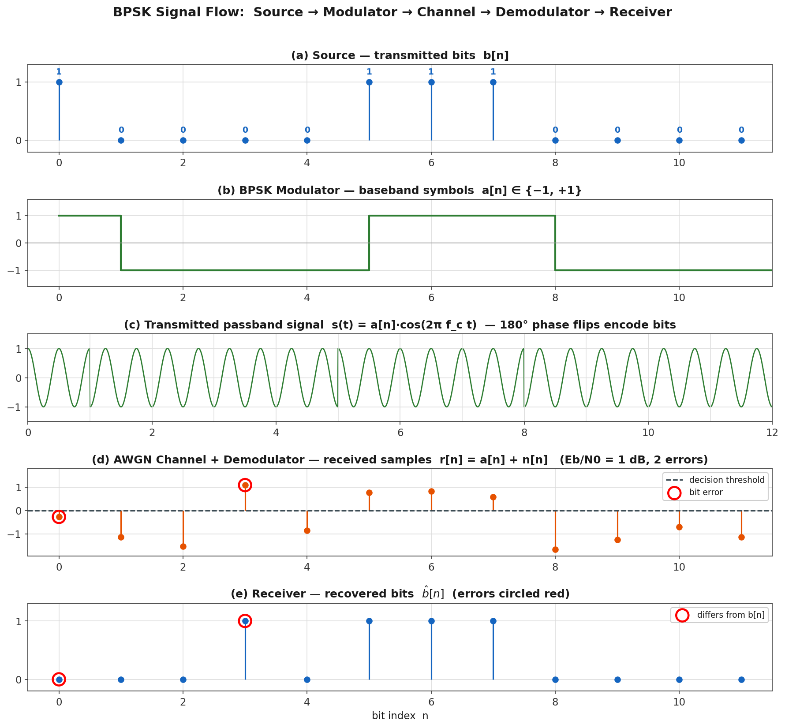
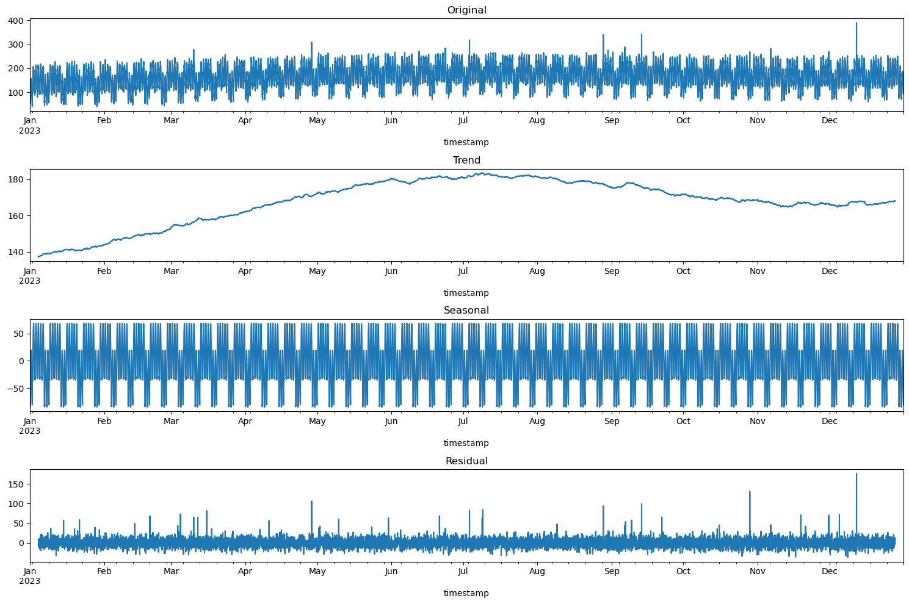

# Martin Demel — AI for 5G/6G Communications & O-RAN Networks Portfolio

**Course:** ITAI 4370 — AI 5/6G Communications & O-RAN Networks (6263-ITAI-4370-S10-14071)<br>
**Institution:** Houston Community College, Department of Science, Technology, Engineering & Math<br>
**Instructor:** Tawanda Chiyangwa<br>
**Term:** Summer 2026

**Final Exam Portfolio** — this document records, module by module, what I did in the course, the results I produced, and what I learned from the experience.



## About me

I'm Martin Demel. My background is in IT service management and customer success, operational transformation, and data-driven decision-making, plus an ITIL 4 Managing Professional certification.

I selected this course because modern networks are where AI stops being an app and becomes infrastructure: 5G is the first mobile generation explicitly designed to be *operated* by machine learning — traffic forecasting, self-organizing radio networks, and intelligent controllers are part of the architecture itself. I wanted to understand that stack from the physics up.

## What's in this repo

This repository is my **live Course Portfolio** for ITAI 4370: the assignments, laboratories, midterm, and final exam I completed, plus the reflective essays, project documentation, and growth evidence of the Course Portfolio assessment.

```
ITAI-4370-5G/
├── Assignments/
│   ├── A01_Telecommunications_Fundamentals/
│   ├── A02_5G_Architecture_and_Intelligence/
│   └── A03_AI_ML_and_Open_RAN/
├── Labs/
│   ├── L01_Communication_System_Signal_Flow/   (+ extended notebook & BPSK analysis suite)
│   ├── L02_RF_Propagation_FSPL/
│   ├── L03_Network_Traffic_Prediction/
│   ├── L04_Time_Series_Prediction/
│   └── L05_Edge_Model_Optimization/
├── Midterm/
│   └── Network_Simulation_and_Prediction/
├── Course_Portfolio/                            (reflective essays · project documentation · growth evidence)
│   ├── Reflective_Essays/
│   ├── Project_Documentation.md
│   └── Growth_Evidence.md
├── Final_Exam_Portfolio/                        (module-by-module portfolio as the submitted PDF)
└── assets/                                      (figures used in this README)
```

## Index

### Assignments

| # | Topic | Week of |
|---|-------|---------|
| A01 | [Telecommunications Fundamentals](Assignments/A01_Telecommunications_Fundamentals/) | June 8, 2026 |
| A02 | [5G Architecture & Intelligence](Assignments/A02_5G_Architecture_and_Intelligence/) | June 15, 2026 |
| A03 | [AI/ML Applications & Open RAN](Assignments/A03_AI_ML_and_Open_RAN/) | June 22, 2026 |

### Laboratories

| # | Topic | Week of |
|---|-------|---------|
| L01 | [Communication System & Signal Flow (BPSK)](Labs/L01_Communication_System_Signal_Flow/) | June 8, 2026 |
| L02 | [RF Propagation Modeling — Free-Space Path Loss](Labs/L02_RF_Propagation_FSPL/) | June 15, 2026 |
| L03 | [Network Traffic Prediction (Supervised Learning)](Labs/L03_Network_Traffic_Prediction/) | June 22, 2026 |
| L04 | [Time-Series Prediction — ARIMA vs Regression vs LSTM](Labs/L04_Time_Series_Prediction/) | June 29, 2026 |
| L05 | [Edge Computing — Model Optimization](Labs/L05_Edge_Model_Optimization/) | July 6, 2026 |

### Projects

- [Midterm — Network Simulation & Predictive Optimization](Midterm/Network_Simulation_and_Prediction/) (SimPy · Mesa · scikit-learn)
- [Final Exam — this Portfolio](Final_Exam_Portfolio/) (submitted as `FE Martin Demel ITAI 4370.pdf`)

### Course Portfolio (15% assessment)

- [Portfolio guide & rubric map](Course_Portfolio/) — where every required component lives
- Reflective essays: [How my understanding of telecommunications evolved](Course_Portfolio/Reflective_Essays/01_How_My_Understanding_of_Telecommunications_Evolved.md) · [Applying AI to telecommunications problems](Course_Portfolio/Reflective_Essays/02_Applying_AI_to_Telecommunications_Problems.md) · [Skills improved & future growth](Course_Portfolio/Reflective_Essays/03_Skills_Improved_and_Areas_for_Future_Growth.md)
- [Project documentation](Course_Portfolio/Project_Documentation.md) — problem statements, methods, code, results, and interpretation for all six practical projects
- [Growth evidence](Course_Portfolio/Growth_Evidence.md) — the basic → advanced progression, with links to dated artifacts

---

# Portfolio by Module

## Module 1 — Telecommunications Fundamentals *(week of June 8, 2026)*

### Activities

- **Assignment 1 — Telecommunication Questions.** Wrote an APA-style paper answering five questions: the definition and modern scope of a telecommunications system; the roles of transmitter, channel, and receiver; analog vs. digital communication and the metrics used to evaluate them (bandwidth, SNR, latency, throughput, jitter, error rate); the four communication types (voice, data, video, multimedia) and how topology and architecture affect them; and how star, mesh, ring, and bus topologies trade off performance, reliability, and scalability.
- **Laboratory 1 — Communication System & Signal Flow.** Modeled a digital link two ways. Part 1: a conceptual five-block diagram — `Source → Modulator → Channel → Demodulator → Receiver` — built in Draw.io and reproduced programmatically in Matplotlib. Part 2: a working Python (NumPy) simulation of the same chain using BPSK on a cosine carrier over an AWGN channel, starting from the course's practical BPSK example and extending it with coherent demodulation and threshold detection.
- **Extended analysis.** Beyond the brief, I built a full BPSK analysis suite (`bpsk_comm_analysis.py` and a detailed notebook): a per-stage signal-flow figure, received constellations at high and low SNR, and a 1,000,000-bit-per-point Monte-Carlo bit-error-rate (BER) sweep validated against the closed-form theory *P<sub>b</sub> = ½·erfc(√(E<sub>b</sub>/N<sub>0</sub>))*.

### Results

The simulation recovered the transmitted message perfectly at moderate noise (8/8 bits, zero errors at σ = 0.5), and the Monte-Carlo BER matched theory across the whole 0–10 dB sweep:

| E<sub>b</sub>/N<sub>0</sub> (dB) | Simulated BER | Theoretical BER |
|---:|---:|---:|
| 0 | 7.86e-02 | 7.86e-02 |
| 4 | 1.26e-02 | 1.25e-02 |
| 7 | 7.78e-04 | 7.73e-04 |
| 10 | 3.00e-06 | 3.87e-06 |




### What I learned

Every digital link — up to and including a 5G NR radio — reduces to the same five blocks; 5G just uses higher-order modulation (QPSK to 256-QAM) on thousands of OFDM subcarriers. The channel is the only place the signal is degraded, and everything after it exists to undo that damage. The BER-vs-E<sub>b</sub>/N<sub>0</sub> "waterfall" made the digital advantage concrete: in the steep region, roughly every extra 1 dB of SNR halves the error rate, which is why link budgets are fought over in single decibels. Matching my simulation to the closed-form theory taught me to treat agreement with theory as the test that a simulation is actually correct.

---

## Module 2 — Network Architecture, Wireless Basics & the 5G Core *(week of June 15, 2026)*

### Activities

- **Module study.** Worked through the Module 2 material: the OSI and TCP/IP models, access vs. core networks, the RF spectrum and propagation impairments (path loss, attenuation, multipath fading), the 1G→5G evolution, and Wireshark packet analysis.
- **Assignment 2 — 5G Architecture & Intelligence.** Wrote an APA-style paper on five questions: EPC (4G) vs. 5GC (5G) core networks; why network slicing matters (with real-world examples across eMBB, URLLC, and mMTC service classes); what Multi-access Edge Computing (MEC) is and how it cuts latency; the role of AI in dynamic resource allocation; and what the Network Repository Function (NRF) does in the Service-Based Architecture.
- **Laboratory 2 — RF Propagation Modeling.** Implemented the Free-Space Path Loss model *FSPL(dB) = 20·log₁₀(d) + 20·log₁₀(f) + 32.44* in Python: first the course's 2.4 GHz scenario, then an extension comparing four bands used by real networks (900 MHz low-band, 2.4 GHz Wi-Fi, 3.5 GHz 5G n78, 28 GHz mmWave).

### Results

Path loss grows with both distance and frequency. At 2.4 GHz the loss is ~100 dB at 1 km and ~126 dB at 20 km. Comparing bands at a fixed 1 km:

| Band | FSPL at 1 km |
|------|-------------:|
| 900 MHz (low-band) | 91.5 dB |
| 2.4 GHz (Wi-Fi) | 100.0 dB |
| 3.5 GHz (5G n78) | 103.3 dB |
| 28 GHz (mmWave) | 121.4 dB |

The 28 GHz signal loses ~30 dB more than 900 MHz at the same distance — about one-thousandth of the received power.


### What I learned

This module connected physics to architecture. The ~30 dB penalty at mmWave is *why* 5G high-band is deployed as dense small cells while low-band carries wide-area coverage — the network's shape is the propagation physics made visible. On the core side, the real 4G→5G change is not speed but software: the 5GC replaces fixed hardware nodes with cloud-native network functions on a service bus (with control and user planes fully separated), which is what makes slicing, MEC, and per-function scaling possible at all. The NRF was the detail that made the Service-Based Architecture click for me — a modular core only works if functions can register and discover each other at run time, exactly like service discovery in a microservices system, which parallels the service-registry patterns I know from ITIL-managed platforms.

---

## Module 3 — AI/ML in the RAN & Open RAN *(week of June 22, 2026)*

### Activities

- **Assignment 3 — AI/ML Applications & Open RAN.** Wrote an APA-style paper on five questions: AI/ML examples for radio resource management (predictive resource-block scheduling) and reliability (anomaly detection before faults); how Self-Organizing Networks self-optimize and self-heal, and how predictive maintenance protects Quality of Service; what normalizing user demand achieves in a resource-allocation simulation and how it maps to proportional scheduling of physical resource blocks; traditional RAN vs. Open RAN (disaggregation into RU/DU/CU and open, standardized interfaces); and the split between the Near-RT RIC (10 ms–1 s control loops, xApps) and Non-RT RIC (>1 s loops, rApps, policy and model training).
- **Laboratory 3 — Network Traffic Prediction.** Built a supervised model that predicts hourly network traffic: generated a synthetic year of traffic with daily, weekly, annual, and business-hours patterns; engineered lag features (1 h, 24 h) and a 7-day rolling average; trained a 100-tree Random Forest; and evaluated it on a strictly time-ordered split so the model is tested only on later, unseen hours.

### Results

| Metric | Train | Test |
|--------|------:|-----:|
| MSE | 17.58 | 34.65 |
| R² | 0.946 | **0.893** |

Feature importance: the traffic one hour ago dominates (0.816), followed by hour-of-day (0.078) and the 24-hour lag (0.036).


### What I learned

Network traffic is highly learnable because it is habitual — the strongest predictor of the next hour is simply the last hour, plus the time of day. Two methodology lessons stuck with me. First, forecasting must be evaluated with a time-ordered split; shuffling would leak the future into training and flatter the scores. Second, prediction is only step one of control: in Open RAN the forecast feeds an xApp on the Near-RT RIC that reallocates resource blocks *before* congestion forms, with the Non-RT RIC training the models and setting policy on slower timescales. The assignment's normalization question tied it together — turning raw demands into proportional shares is what makes a fixed pool of radio resources divisible, fair, and numerically stable.

---

## Module 4 — Network Simulation & Time-Series Forecasting *(week of June 29, 2026)*

### Activities

- **Midterm — Network Simulation & Predictive Optimization.** Solved three hands-on problems: (1) a **SimPy** discrete-event simulation of packets flowing through a chain of three routers, measuring per-packet processing delay and total latency; (2) a **Mesa** agent-based model of five router agents on a Watts–Strogatz small-world graph whose loads fluctuate randomly and that announce rerouting when load exceeds an overload threshold; and (3) a **scikit-learn** linear-regression traffic predictor on lagged synthetic traffic, demonstrating AI-driven predictive optimization of routing.
- **Laboratory 4 — Time-Series Prediction.** Compared three forecasters on a simulated year of hourly traffic (daily/weekly cycles, yearly trend, seasonal term, congestion spikes): **ARIMA(2,1,2)**, **Linear Regression** on 16 engineered features (cyclical hour/weekday/day-of-year encodings, lags of 1–168 h, moving averages), and a **PyTorch LSTM** reading 24-hour sequences. Verified stationarity with the Augmented Dickey-Fuller test, ran a weekly-period seasonal decomposition, and split the year 80/20 in time order. I also found and fixed a target-leakage bug in the brief's feature code — its moving averages included the current hour (the value being predicted), which produced a meaningless R² of 1.0 until I shifted them to use only past hours.

### Results

| Model | MSE | MAE | RMSE | R² |
|-------|----:|----:|-----:|---:|
| ARIMA(2,1,2) | 2604.37 | 42.38 | 51.03 | −0.181 |
| Linear Regression | 950.83 | 27.42 | 30.84 | 0.572 |
| **LSTM** | **227.12** | **10.68** | **15.07** | **0.897** |




### What I learned

The model has to match the structure of the signal: a non-seasonal ARIMA forecasting a long horizon flattens to the mean of strongly cyclical traffic (negative R²), linear regression recovers the weekly cycle through hand-built lag features (R² ≈ 0.57), and the LSTM learns the daily shape directly from raw sequences and wins (R² ≈ 0.90). The leakage bug was the biggest lesson of the course for me: a feature computed over a window that includes the target produces a *perfect-looking* and completely worthless model, and the fix — shift every window so it sees only the past — is one line. I also learned to state comparison caveats honestly: ARIMA forecast the whole test period at once while the other two predicted one hour ahead from recent actuals, so the gap reflects both model and task. The midterm added the systems side: discrete-event simulation (SimPy) captures queueing and cumulative latency, while agent-based modeling (Mesa) shows congestion and rerouting emerging from local per-router rules — two complementary ways to model a network before you touch real hardware.

---

## Module 5 — Edge Computing & Model Optimization *(week of July 6, 2026)*

### Activities

- **Laboratory 5 — Edge Computing Simulation.** Simulated deploying ML on resource-constrained edge devices. Trained a baseline "cloud" MLP (128→64→32) on a synthetic IoT sensor-classification dataset (10,000 samples, 20 features, 3 device states), then applied three compression techniques and measured what each costs and saves: **pruning** (L1-unstructured removal of 50% of weights, then fine-tuning), **INT8 quantization** (symmetric per-layer weight quantization), and **knowledge distillation** (a 10× smaller student trained on the teacher's temperature-softened outputs, T = 3, α = 0.5). The course brief targeted TensorFlow/TFLite, which crashed in my environment — so I reimplemented the entire lab in PyTorch and made each technique real, including the distillation loss the brief defined but never actually used.

### Results

| Model | Accuracy | Size (KB) | Parameters | Inference (ms) | Compression |
|-------|---------:|----------:|-----------:|---------------:|------------:|
| Baseline (cloud) | 96.2% | 51.26 | 13,123 | 0.053 | 1.0× |
| Pruned (50%) | 96.7% | 26.07 | 13,123 (49.1% zero) | 0.054 | 2.0× |
| Quantized (INT8) | 96.1% | 12.82 | 13,123 | 0.055 | 4.0× |
| Distilled | 92.7% | 4.89 | 1,251 | **0.029** | **10.5×** |


Deployment mapping: distilled or INT8 for microcontrollers, pruned or quantized for edge gateways, the full baseline for edge servers.

### What I learned

Model compression is a trade-off space, not a single trick: pruning and quantization preserved the baseline's accuracy at 2–4× smaller storage, while distillation bought 10× compression and the fastest inference for ~3.5 points of accuracy. A subtle hardware lesson: only the distilled model — a genuinely smaller network — actually ran faster on standard hardware; zeroed weights and simulated INT8 shrink *storage* but need sparse or integer execution units to speed up *compute*. This module closed the loop with Module 2: MEC only reduces latency if the model can physically live at the edge, and these techniques are exactly what makes that possible. Rebuilding the lab in PyTorch also taught me that briefs and tutorials can contain placeholder code — the distillation loss that was defined but never used — and that reimplementing something is the fastest way to find that out.

---

## Final Exam — This Portfolio *(week of July 13, 2026)*

Compiled this module-by-module record of activities, results, and learnings; assembled all deliverables into this repository ([github.com/martindemel/ITAI-4370-5G](https://github.com/martindemel/ITAI-4370-5G)); and exported this document as **`FE Martin Demel ITAI 4370.pdf`** for submission.

---

## Course Reflection

The through-line of this course is that **the network became software, and the software is becoming learned**. Module 1 gave me the physical layer's vocabulary (modulation, noise, BER); Module 2 showed how propagation physics dictates architecture and how the 5G core turned into cloud-native services; Module 3 introduced the control plane where ML actually runs (SON, RIC, xApps/rApps); Module 4 built the forecasting and simulation muscles that intelligence depends on; and Module 5 made the models small enough to live at the edge, where the latency budget is. What I take away professionally: the skills of this course — honest evaluation of predictive models, simulation before deployment, and knowing what runs where and why — transfer directly to operating any large software platform, not just a radio network.

## Valuable Resources

Links I found genuinely useful while doing the work:

- **3GPP — 5G System Overview** — the authoritative map of the 5G core: <https://www.3gpp.org/technologies/5g-system-overview>
- **3GPP — Self-Organising Networks (SON)**: <https://www.3gpp.org/technologies/son>
- **O-RAN Alliance specifications** (RIC architecture, open interfaces): <https://www.o-ran.org>
- **ETSI White Paper #28 — MEC in 5G Networks**: <https://www.etsi.org/images/files/ETSIWhitePapers/etsi_wp28_mec_in_5G_FINAL.pdf>
- **ITU-R P.525 — Calculation of free-space attenuation** (the FSPL formula's source): <https://www.itu.int/rec/R-REC-P.525>
- **Qazzaz et al. (2024) — ML-based xApp for dynamic resource allocation in O-RAN** (arXiv): <https://arxiv.org/abs/2401.07643>
- **IBM — What is network topology?**: <https://www.ibm.com/think/topics/network-topology>
- **Wireshark** (packet capture and protocol analysis): <https://www.wireshark.org>
- **Draw.io / diagrams.net** (block diagrams): <https://app.diagrams.net>
- **SimPy** (discrete-event simulation): <https://simpy.readthedocs.io> · **Mesa** (agent-based modeling): <https://mesa.readthedocs.io>
- **statsmodels time-series API** (ARIMA, decomposition, ADF): <https://www.statsmodels.org>
- **PyTorch** (LSTM, pruning utilities): <https://pytorch.org>

## References

Citations for intellectual property used across the assignments and labs (APA):

- 3GPP. (n.d.). *5G system overview.* https://www.3gpp.org/technologies/5g-system-overview
- 3GPP. (n.d.). *Self-organising networks (SON).* https://www.3gpp.org/technologies/son
- Chiyangwa, T. (2026). *ITAI 4370 course materials: Module lectures, practical examples, exercises, and laboratory briefs* [Course handouts]. Houston Community College.
- International Telecommunication Union. (1993). *Recommendation ITU-R V.662-2: Terms and definitions.* https://www.itu.int/dms_pubrec/itu-r/rec/v/R-REC-V.662-2-199304-S!!PDF-E.pdf
- International Telecommunication Union. (2015). *Recommendation ITU-R M.2083-0: IMT vision – Framework and overall objectives of the future development of IMT for 2020 and beyond.* https://www.itu.int/rec/R-REC-M.2083
- International Telecommunication Union. (2024). *Recommendation ITU-R P.525-5: Calculation of free-space attenuation.* https://www.itu.int/rec/R-REC-P.525
- Kekki, S. (Ed.). (2018). *MEC in 5G networks* (ETSI White Paper No. 28). European Telecommunications Standards Institute. https://www.etsi.org/images/files/ETSIWhitePapers/etsi_wp28_mec_in_5G_FINAL.pdf
- Khan, T., Jackson, G., & Goodwin, M. (n.d.). *What is network topology?* IBM. https://www.ibm.com/think/topics/network-topology
- Mohamed Jabarullah, M. A. K. (2022). PredictNet: AI-enabled predictive maintenance system for telecommunications infrastructure reliability. *World Journal of Advanced Research and Reviews.* https://wjarr.com/node/7724
- O-RAN Alliance. (n.d.). *O-RAN Alliance: Specifications for the open, intelligent, virtualized and fully interoperable RAN.* https://www.o-ran.org
- Qazzaz, M. M. H., Kułacz, Ł., Kliks, A., Zaidi, S. A., Dryjanski, M., & McLernon, D. (2024). *Machine learning-based xApp for dynamic resource allocation in O-RAN networks.* arXiv. https://arxiv.org/abs/2401.07643
- Stark, W. E. (2026, May 29). Telecommunication. *Encyclopaedia Britannica.* https://www.britannica.com/technology/telecommunication

**Software:** Python 3, NumPy, SciPy, pandas, Matplotlib, seaborn, scikit-learn, statsmodels, PyTorch, SimPy, Mesa, NetworkX, Jupyter, Draw.io/diagrams.net. AI assistance (Anthropic Claude) was used as a study and implementation aid; all submitted analysis and conclusions are my own work for this course.

## How to view the work

- **Word documents (`.docx`)** — the written assignments; download from GitHub to view.
- **Jupyter notebooks (`.ipynb`)** — render inline on GitHub with all outputs embedded. To re-run locally: `pip install jupyterlab numpy scipy pandas matplotlib seaborn scikit-learn statsmodels torch`, then open the notebook. Every notebook uses a fixed random seed (42) for reproducibility.
- **PDFs** — each lab folder also contains the notebook exported as PDF, viewable directly in the browser.
